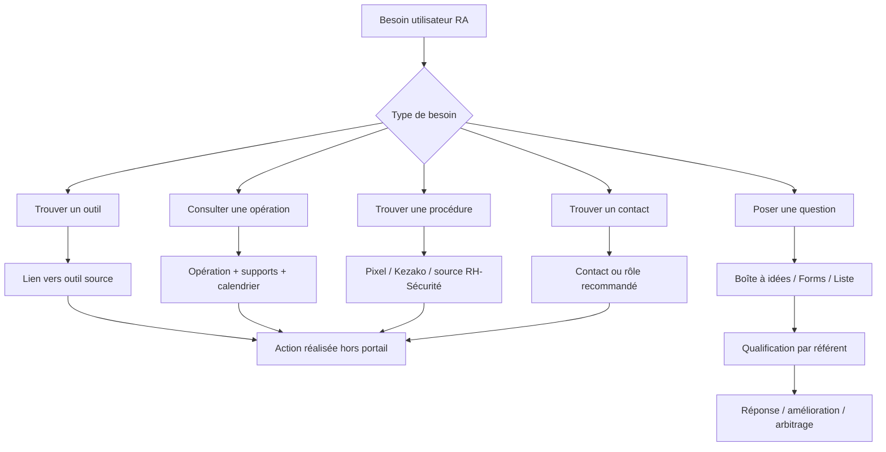

# Processus cibles — Portail Régional Sud-Est

Date : 18 mai 2026  
Projet : Portail Régional Sud-Est — SharePoint / Microsoft 365  
Objet : cartographie complète des processus prévus, classés du cœur V1 aux extensions V2  

---

## 0. Logique de classement

Les processus sont classés en 4 parties, du plus central au moins prioritaire :

1. **Cœur opérationnel V1** : ce que le responsable d'agence doit pouvoir faire immédiatement.
2. **Alimentation et gouvernance** : ce qui permet au portail de rester vivant et fiable.
3. **Déploiement, pilotage et validation** : ce qui permet de lancer, tester et améliorer le portail.
4. **Extensions V2 / moins prioritaires** : fonctions utiles mais non indispensables au démarrage.

La V1 doit rester simple. Elle doit aider à trouver rapidement :

- le bon outil ;
- le bon support ;
- la bonne opération ;
- le bon contact ;
- la bonne procédure ;
- le bon canal pour poser une question ou remonter un irritant.

---

# Partie 1 — Cœur opérationnel V1

Cette partie regroupe les processus indispensables. Ce sont les parcours qui justifient l'existence du portail dès la première version.

## P1 — Accéder rapidement à un outil ou une source

### Objectif

Permettre à un responsable d'agence de rejoindre rapidement l'outil ou la source officielle sans chercher dans Pixel, Teams, mails ou favoris personnels.

### Acteurs

- Responsable d'agence.
- RRV / chef des ventes.
- Assistante de pôle.
- Utilisateur standard selon besoin.

### Déclencheur

L'utilisateur a besoin d'ouvrir un outil métier ou une source documentaire.

### Outils concernés

- Pixel / Annuaire Pixel.
- CRM Rexel UI.
- Qlik / Qliksense.
- Kezako.
- Yoobic.
- Rexel One News.
- Configurateur / démonstrateur digital.
- Pico — variables commerciaux, si confirmé.
- Get Paid, si confirmé.

### Étapes

1. L'utilisateur arrive sur l'accueil du portail.
2. Il repère le bloc **Outils RA** ou **Poste de pilotage RA**.
3. Il sélectionne la tuile correspondant à son besoin.
4. Le portail redirige vers l'outil source.
5. L'utilisateur poursuit son action dans l'outil source.

### Sortie attendue

L'utilisateur arrive au bon outil en un ou deux clics.

### WebParts / composants SharePoint

- Tableau de bord.
- Liens rapides.
- Lien.
- Bouton d'action.
- Mes Applications si pertinent.

### Données nécessaires

Liste **Accès utiles** :

- Titre.
- Catégorie.
- URL.
- Description courte.
- Source.
- Profil prioritaire.
- Propriétaire du lien.
- Statut.
- Dernière vérification.

### Points de vigilance

- Ne pas créer une page par outil.
- Ne pas dupliquer les contenus des outils sources.
- Vérifier régulièrement les liens.
- Ne pas afficher les outils non confirmés comme essentiels.

---

## P2 — Consulter l'opération commerciale du moment

### Objectif

Rendre immédiatement visible l'opération commerciale prioritaire et les supports associés.

### Acteurs

- Responsable d'agence.
- RRV / chef des ventes.
- Commerce / RACOR.
- Assistante de pôle.

### Déclencheur

Une opération commerciale est en cours ou à venir.

### Étapes

1. Le commerce / RACOR identifie l'opération à mettre en avant.
2. Les supports sont stabilisés : kit, PLV, argumentaire, dates.
3. L'opération est ajoutée dans la liste ou la zone dédiée.
4. Le bloc **Opération du moment** est mis à jour.
5. L'utilisateur consulte l'opération depuis l'accueil.
6. Il ouvre le kit, les supports PLV ou le calendrier.

### Sortie attendue

L'agence dispose d'une information claire : quoi faire, quand, avec quels supports.

### WebParts / composants SharePoint

- Carte éditoriale.
- Focus.
- Liste.
- Bibliothèque de documents.
- Bouton d'action.
- Actualités.

### Données nécessaires

Liste **Opérations commerciales** :

- Nom de l'opération.
- Date de début.
- Date de fin.
- Statut.
- Périmètre.
- Kit commercial.
- Support PLV.
- Argumentaire.
- Contact référent.
- Lien source.
- Sensibilité.

### Points de vigilance

- Ne pas afficher de données commerciales sensibles.
- Ne pas refaire le CRM.
- Ne pas transformer SharePoint en outil de pilotage commercial.
- Toujours associer une date et un lien source.

---

## P3 — Consulter le calendrier des opérations et échéances utiles

### Objectif

Donner une vue simple des échéances à ne pas manquer.

### Acteurs

- Responsable d'agence.
- Commerce / RACOR.
- RRV / chef des ventes.
- Assistante de pôle.

### Déclencheur

Une échéance commerciale, terrain, RH ou sécurité doit être visible.

### Étapes

1. Le référent identifie une échéance utile.
2. L'échéance est ajoutée au calendrier source ou à une liste calendrier.
3. Le portail affiche les prochaines échéances.
4. L'utilisateur consulte l'agenda depuis l'accueil.
5. Il ouvre le détail ou le lien source si besoin.

### Sortie attendue

Les dates importantes sont visibles sans fouiller les mails.

### WebParts / composants SharePoint

- Événements.
- Calendrier de groupe.
- Liste avec vue calendrier.
- Bouton vers calendrier source.

### Données nécessaires

Liste **Événements / échéances** :

- Titre.
- Date.
- Heure si applicable.
- Type.
- Périmètre.
- Lien source.
- Contact.

### Points de vigilance

- Afficher peu d'événements.
- Ne pas créer un calendrier exhaustif.
- Conserver le calendrier officiel si un calendrier Grégoire existe.

---

## P4 — Trouver une procédure, une règle ou une information Sécurité / RH

### Objectif

Donner un accès direct aux contenus Sécurité, RH et procédures utiles au responsable d'agence.

### Acteurs

- Responsable d'agence.
- Assistante de pôle.
- RH régionale.
- Référent sécurité.

### Déclencheur

L'utilisateur a une question sécurité, RH, procédure ou règle d'or.

### Étapes

1. L'utilisateur ouvre le bloc **Sécurité & RH**.
2. Il choisit un sujet : livre sécurité, mutuelle, prévoyance, feuille de liaison, procédure.
3. Le portail redirige vers Pixel, Kezako ou la source officielle.
4. Si le besoin n'est pas couvert, l'utilisateur peut poser une question via le bloc Questions.

### Sortie attendue

L'utilisateur trouve rapidement la source de référence.

### WebParts / composants SharePoint

- Liste.
- Liens rapides.
- Contenu mis en évidence.
- Bouton.
- Message d'information.

### Données nécessaires

Liste **Procédures et liens utiles** :

- Sujet.
- Catégorie.
- Lien source.
- Description courte.
- Propriétaire.
- Date de vérification.

### Points de vigilance

- Ne pas recopier Pixel.
- Ne pas créer un dépôt documentaire parallèle.
- Privilégier les liens vers les sources maintenues.

---

## P5 — Poser une question, partager une idée ou remonter un irritant

### Objectif

Permettre aux responsables d'agence de s'exprimer sans créer un outil de ticketing lourd.

### Acteurs

- Responsable d'agence.
- RRV / chef des ventes.
- Référent portail.
- Référent métier selon sujet.

### Déclencheur

L'utilisateur veut poser une question, partager une bonne pratique ou signaler un irritant.

### Étapes

1. L'utilisateur ouvre le bloc **Questions, contacts & terrain**.
2. Il choisit le type : question, idée, irritant.
3. Il renseigne un formulaire court.
4. La demande est enregistrée dans une liste ou une boîte à idées.
5. Un référent qualifie la demande.
6. Un statut est attribué : reçu, en cours, répondu, clôturé.
7. La réponse ou suite donnée est visible si elle est partageable.

### Sortie attendue

Les remontées terrain sont captées, qualifiées et suivies simplement.

### WebParts / composants SharePoint

- Boîte à idées.
- Microsoft Forms.
- Liste.
- Power Automate en V2.

### Données nécessaires

Liste **Questions / idées / irritants** :

- Type.
- Sujet.
- Description.
- Pôle / agence.
- Auteur.
- Date.
- Statut.
- Référent.
- Réponse.

### Points de vigilance

- Ne pas promettre un traitement urgent.
- Ne pas remplacer Smart / support / ticketing.
- Éviter les champs trop nombreux.
- Prévoir une modération.

---

## P6 — Trouver le bon contact

### Objectif

Réduire la dépendance aux personnes-ressources informelles en clarifiant qui contacter pour quoi.

### Acteurs

- Responsable d'agence.
- Assistante de pôle.
- RRV / chef des ventes.
- Experts / IAS.
- Fonctions support.

### Déclencheur

L'utilisateur ne sait pas qui solliciter.

### Étapes

1. L'utilisateur ouvre **Contacts** ou **Qui contacter ?**.
2. Il choisit un sujet : commerce, sécurité, RH, procédure, expertise, support.
3. Le portail affiche le contact ou rôle associé.
4. L'utilisateur contacte la bonne personne via le canal recommandé.

### Sortie attendue

L'utilisateur identifie le bon interlocuteur sans passer par plusieurs relais.

### WebParts / composants SharePoint

- Contacts.
- Rôle des contacts.
- Trombinoscope.
- Organigramme.
- Liste.

### Données nécessaires

Liste **Contacts utiles** :

- Nom.
- Rôle.
- Sujet.
- Pôle.
- Canal recommandé.
- Mail.
- Téléphone si autorisé.
- Dernière vérification.

### Points de vigilance

- Ne pas afficher un organigramme trop lourd en V1.
- Vérifier la fiabilité des données.
- Distinguer personne, rôle et canal de contact.

---

## P7 — Consulter une actualité utile et agir

### Objectif

Faire ressortir uniquement les actualités utiles, datées et actionnables.

### Acteurs

- Responsable d'agence.
- Commerce / RACOR.
- Référent régional.
- Assistante de pôle.

### Déclencheur

Une information doit être rendue visible : opération, support, rappel, événement, info terrain.

### Étapes

1. Le référent publie ou sélectionne une actualité.
2. L'actualité est datée et rattachée à une source.
3. Le portail l'affiche dans le bloc Actualités.
4. L'utilisateur consulte l'actualité.
5. Il ouvre le lien source ou effectue l'action demandée.

### Sortie attendue

L'information importante ne disparaît pas dans les mails.

### WebParts / composants SharePoint

- Actualités.
- Actualités avancées.
- Message d'information.
- Focus.

### Données nécessaires

Pages d'actualités ou liste :

- Titre.
- Date.
- Catégorie.
- Audience si V2.
- Lien source.
- Date d'expiration si besoin.

### Points de vigilance

- Ne pas créer un journal régional complet.
- Limiter le nombre d'actualités visibles.
- Distinguer actualité et dépôt documentaire.

---

# Partie 2 — Alimentation et gouvernance

Ces processus ne sont pas toujours visibles par les utilisateurs, mais ils déterminent la fiabilité du portail.

## P8 — Créer ou mettre à jour une opération commerciale

### Objectif

Publier une opération commerciale de façon stable, datée et retrouvable.

### Acteurs

- Commerce / RACOR.
- RRV / chef des ventes.
- Référent portail.
- Assistante de pôle si relais.

### Déclencheur

Une nouvelle opération est validée ou mise à jour.

### Étapes

1. Le référent commerce confirme les informations publiables.
2. Les supports sont déposés dans la source officielle.
3. La ligne opération est créée ou mise à jour.
4. Les liens vers kit, PLV, argumentaire et calendrier sont ajoutés.
5. Le statut est défini : à venir, en cours, terminé, archivé.
6. Si l'opération est prioritaire, elle remonte en accueil.
7. Une communication mail peut pointer vers le portail.

### Sorties

- Opération visible.
- Supports accessibles.
- Date de validité claire.

### WebParts / listes

- Liste Opérations commerciales.
- Bibliothèque de documents.
- Carte éditoriale.
- Actualités.
- Événements.

### Points de vigilance

- Valider la sensibilité des contenus.
- Ne pas exposer de données clients ou commerciales confidentielles.
- Prévoir l'archivage.

---

## P9 — Publier une actualité ou information régionale

### Objectif

Stabiliser les communications importantes et éviter qu'elles restent uniquement dans les mails.

### Acteurs

- Référent régional.
- Commerce / RACOR.
- RH / sécurité selon sujet.
- Référent portail.

### Déclencheur

Une information doit être portée à la connaissance des agences ou pôles.

### Étapes

1. Le référent rédige une actualité courte.
2. Il ajoute une date, une catégorie et un lien source.
3. Il vérifie que le contenu peut être publié.
4. L'actualité est publiée.
5. Si besoin, un mail annonce l'actualité avec lien vers le portail.
6. L'actualité est retirée ou archivée quand elle n'est plus utile.

### Sorties

- Actualité publiée.
- Information retrouvable.
- Lien source disponible.

### WebParts / listes

- Actualités.
- Message d'information.
- Contenu mis en évidence.

### Points de vigilance

- Éviter les textes longs.
- Mettre une date d'expiration si possible.
- Ne pas publier des brouillons.

---

## P10 — Maintenir les accès utiles

### Objectif

Éviter les liens morts et garder les accès rapides fiables.

### Acteurs

- Référent portail.
- Propriétaires de liens.
- Administrateur SharePoint.

### Déclencheur

Vérification périodique ou signalement d'un lien cassé.

### Étapes

1. La liste des accès utiles est revue.
2. Chaque lien est testé.
3. Le statut est mis à jour : actif, à corriger, obsolète.
4. Le propriétaire du lien est contacté si besoin.
5. Le lien est corrigé, remplacé ou retiré.

### Sorties

- Liens fiables.
- Liste d'accès propre.

### WebParts / listes

- Liste Accès utiles.
- Liens rapides.
- Tableau de bord.

### Fréquence

Mensuelle ou trimestrielle selon criticité.

### Points de vigilance

- Identifier un propriétaire par lien.
- Ne pas empiler des liens non utilisés.
- Retirer les accès obsolètes.

---

## P11 — Maintenir les contacts utiles

### Objectif

Garder les contacts affichés fiables et exploitables.

### Acteurs

- Référent portail.
- Assistantes de pôle.
- RH / management selon données.
- Référents métiers.

### Déclencheur

Changement d'organisation, départ, arrivée, évolution de rôle.

### Étapes

1. Le changement est signalé.
2. La liste Contacts utiles est mise à jour.
3. Le sujet ou rôle associé est vérifié.
4. Les WebParts Contacts / Rôle des contacts se mettent à jour.
5. Une vérification trimestrielle consolide les données.

### Sorties

- Contacts à jour.
- Moins de sollicitations mal orientées.

### WebParts / listes

- Contacts.
- Rôle des contacts.
- Trombinoscope.
- Liste Contacts utiles.

### Points de vigilance

- Ne pas dépendre uniquement de l'annuaire M365 si les rôles ne sont pas assez précis.
- Distinguer contact nominatif et rôle fonctionnel.

---

## P12 — Qualifier et traiter une question / idée / remontée

### Objectif

Transformer les contributions terrain en actions, réponses ou arbitrages.

### Acteurs

- Référent portail.
- Référent métier.
- Responsable régional si arbitrage.
- Auteur de la demande.

### Déclencheur

Une question, idée ou remontée est déposée.

### Étapes

1. La contribution arrive dans la liste ou boîte à idées.
2. Le référent portail vérifie le sujet.
3. Il qualifie la demande : question, idée, irritant, hors périmètre.
4. Il assigne un référent métier.
5. Le statut est mis à jour.
6. Une réponse ou suite est donnée.
7. Si le sujet est récurrent, il peut devenir une actualité, une FAQ ou une amélioration du portail.

### Sorties

- Contribution traitée.
- Statut visible.
- Sujet récurrent identifié.

### WebParts / listes

- Boîte à idées.
- Liste Questions / idées.
- Microsoft Forms.
- Power Automate en V2.

### Points de vigilance

- Clarifier que ce n'est pas un canal urgent.
- Éviter le doublon avec Smart ou les circuits support.
- Prévoir une modération.

---

## P13 — Archiver ou retirer un contenu obsolète

### Objectif

Éviter que le portail perde en crédibilité à cause de contenus dépassés.

### Acteurs

- Référent portail.
- Propriétaire du contenu.
- Référent métier.

### Déclencheur

Fin d'opération, lien obsolète, actualité dépassée, document remplacé.

### Étapes

1. Le contenu est identifié comme obsolète.
2. Le propriétaire confirme le retrait ou l'archivage.
3. Le contenu est déplacé, masqué ou remplacé.
4. Les liens associés sont vérifiés.
5. Si nécessaire, une nouvelle version est publiée.

### Sorties

- Portail nettoyé.
- Moins de confusion utilisateur.

### WebParts / listes

- Bibliothèque de documents.
- Liste.
- Actualités.
- Contenu mis en évidence.

### Points de vigilance

- Ne pas supprimer sans vérifier.
- Garder une mémoire des opérations si utile.
- Distinguer archive et contenu actif.

---

# Partie 3 — Déploiement, pilotage et validation

Ces processus permettent de passer de la maquette au portail réel et d'assurer son adoption.

## P14 — Obtenir les droits et préparer l'environnement SharePoint

### Objectif

Disposer des droits nécessaires pour construire et tester réellement le portail.

### Acteurs

- Porteur du projet.
- Luc Séquier / sponsor.
- Propriétaire SharePoint.
- Support Smart / DSI.

### Déclencheur

Le porteur du projet ne peut pas créer ou configurer certaines fonctionnalités.

### Étapes

1. Identifier le site SharePoint cible ou créer un site bac à sable.
2. Vérifier le niveau d'accès actuel.
3. Demander l'accès propriétaire ou les droits nécessaires.
4. Passer par Luc, un propriétaire existant ou Smart si besoin.
5. Vérifier l'accès aux paramètres : pages, listes, navigation, thème, ciblage, WebParts.
6. Documenter les limites restantes.

### Sorties

- Environnement prêt.
- Droits connus.
- Limitations identifiées.

### Points de vigilance

- Ne pas confondre droit de modification de page et droit propriétaire.
- Le ciblage d'audience peut nécessiter des droits ou groupes spécifiques.

---

## P15 — Valider le squelette avec COPIL / direction

### Objectif

Valider l'arborescence, les rubriques et le niveau d'information avant alimentation complète.

### Acteurs

- Luc Séquier.
- COPIL DP.
- Direction régionale.
- Porteur du projet.

### Déclencheur

La maquette V1 est prête à être présentée.

### Étapes

1. Présenter la page d'accueil V1.
2. Expliquer les rubriques sans entrer dans les détails techniques.
3. Valider les blocs prioritaires.
4. Identifier les contenus manquants ou trop sensibles.
5. Décider ce qui reste V1, V2 ou hors périmètre.
6. Mettre à jour le cahier des charges et la maquette.

### Sorties

- Squelette validé.
- Arbitrages documentés.
- Liste de contenus à alimenter.

### Points de vigilance

- Éviter que la validation ajoute trop de rubriques.
- Garder la cible RA en priorité.

---

## P16 — Tester avec des responsables d'agence

### Objectif

Vérifier que le portail fonctionne pour la cible principale.

### Acteurs

- Responsables d'agence.
- Porteur du projet.
- Directeur de pôle ou RRV si besoin.

### Déclencheur

La V1 est suffisamment alimentée pour être testée.

### Étapes

1. Choisir quelques RA pilotes.
2. Inclure au moins un RA récent ou moins autonome.
3. Donner un scénario simple : trouver un outil, un support, un contact, une opération.
4. Observer les hésitations.
5. Noter les liens manquants et libellés ambigus.
6. Corriger la page.
7. Refaire un test court.

### Sorties

- Retours terrain.
- Ajustements d'ergonomie.
- Priorités corrigées.

### Points de vigilance

- Ne pas tester seulement avec des profils experts.
- Privilégier des tests courts en agence.

---

## P17 — Communiquer et lancer le portail

### Objectif

Faire connaître le portail sans supposer que les utilisateurs viendront spontanément.

### Acteurs

- Sponsor.
- Référent portail.
- Managers / DP / RRV.
- Assistantes de pôle.

### Déclencheur

Le portail V1 est prêt pour ouverture.

### Étapes

1. Envoyer un mail de lancement court.
2. Expliquer les usages principaux.
3. Mettre le lien dans les canaux utiles.
4. Demander aux managers de relayer.
5. Prévoir un rappel après quelques semaines.
6. Recueillir les retours.

### Sorties

- Portail connu.
- Premiers usages.
- Retours d'adoption.

### Points de vigilance

- Le mail reste le déclencheur principal.
- Le portail doit être présenté comme un raccourci utile, pas comme un nouvel outil obligatoire.

---

## P18 — Suivre les indicateurs de vie du portail

### Objectif

Mesurer l'usage du portail sans créer un dashboard business.

### Acteurs

- Référent portail.
- Sponsor.
- Business Analyst si besoin sur l'analyse d'activité du portail.

### Déclencheur

Le portail est ouvert à un public pilote ou élargi.

### Étapes

1. Relever les visites.
2. Suivre les clics ou usages si disponibles.
3. Compter les questions / idées.
4. Vérifier les contenus obsolètes.
5. Recueillir des retours qualitatifs.
6. Identifier les blocs non utilisés.
7. Ajuster la page.

### Sorties

- Vue d'adoption.
- Liste d'améliorations.
- Décision de maintien, retrait ou évolution des blocs.

### WebParts / outils

- Utilisation du site.
- Activité du site.
- Indicateur.
- Liste de suivi.

### Points de vigilance

- Ne pas afficher de KPI commerciaux.
- Ne pas refaire Qlik.

---

# Partie 4 — Extensions V2 / moins prioritaires

Ces processus sont utiles, mais ne doivent pas bloquer la V1.

## P19 — Mettre en place le ciblage d'audience

### Objectif

Adapter les contenus mis en avant selon les profils sans créer plusieurs portails.

### Acteurs

- Administrateur SharePoint.
- Sponsor.
- Référent portail.
- Référents métiers.

### Déclencheur

La V1 commune fonctionne et les profils à différencier sont validés.

### Étapes

1. Définir les profils cibles.
2. Identifier les groupes M365 / sécurité disponibles.
3. Décider quels contenus changent selon profil.
4. Configurer le ciblage sur navigation, liens, actualités ou WebParts compatibles.
5. Tester avec plusieurs profils.
6. Documenter la règle : ciblage = priorisation, pas sécurité.

### Sorties

- Contenus priorisés par profil.
- Portail unique conservé.

### Points de vigilance

- Ne pas représenter le ciblage comme un droit d'accès.
- Ne pas créer six portails.
- Protéger les contenus sensibles par permissions réelles.

---

## P20 — Gérer les fournisseurs / fabricants en vigilance

### Objectif

Donner une visibilité utile sur les fournisseurs ou fabricants ayant un impact agence.

### Acteurs

- Expertise / IAS.
- Commerce / RACOR.
- Direction / COPIL.
- Responsable d'agence.

### Déclencheur

Une information fournisseur impacte les agences : disponibilité, approvisionnement, support, contact, vigilance.

### Étapes

1. Le référent identifie une information fournisseur utile.
2. Il vérifie le niveau de sensibilité.
3. Il renseigne une ligne fournisseur.
4. Le portail affiche les vigilances utiles.
5. Les agences consultent le contact ou la source.
6. Les informations obsolètes sont retirées.

### Sorties

- Vigilance fournisseur lisible.
- Contact identifié.
- Source fiable.

### WebParts / listes

- Liste Fournisseurs.
- Contenu mis en évidence.
- Contacts.

### Points de vigilance

- Pas de notation fournisseur contractuelle.
- Pas de RFA / BFA / conditions commerciales.
- Pas de référentiel fournisseur exhaustif.

---

## P21 — Créer une fiche expertise / famille produit

### Objectif

Aider les agences à savoir quand et comment solliciter une expertise.

### Acteurs

- Experts / IAS.
- Responsable expertise.
- Agences.
- Référent portail.

### Déclencheur

Une famille produit ou expertise doit être clarifiée.

### Étapes

1. L'expert définit son périmètre.
2. Il précise les cas où il faut solliciter l'expertise.
3. Il précise les cas à traiter d'abord via source ou procédure.
4. Les contacts et liens utiles sont ajoutés.
5. La fiche est publiée.
6. Les agences consultent la fiche avant sollicitation.

### Sorties

- Fiche expertise courte.
- Contacts et périmètre clarifiés.
- Moins de sollicitations basiques mal orientées.

### WebParts / composants

- Page de site.
- Contacts.
- Rôle des contacts.
- Liens rapides.
- Documents.

### Points de vigilance

- Ne pas créer une encyclopédie technique.
- Garder les fiches courtes.

---

## P22 — Déployer une Power App de remontée avancée

### Objectif

Améliorer la saisie et le suivi des remontées si la boîte à idées / Forms devient insuffisante.

### Acteurs

- Responsable d'agence.
- Référent portail.
- Référent métier.
- Administrateur Power Apps.

### Déclencheur

Les remontées nécessitent un formulaire plus riche ou des statuts plus contrôlés.

### Étapes

1. Définir les cas d'usage.
2. Créer une liste SharePoint source.
3. Générer ou créer l'application Power Apps.
4. Ajouter les écrans : nouvelle demande, suivi, détail.
5. Tester avec quelques utilisateurs.
6. Intégrer l'application dans SharePoint.

### Sorties

- Formulaire plus ergonomique.
- Suivi plus clair.
- Données structurées.

### WebParts / outils

- Power Apps.
- Liste SharePoint.
- Power Automate si notification.

### Points de vigilance

- Ne pas lancer Power Apps trop tôt.
- Garder le formulaire court.
- Vérifier les droits.

---

## P23 — Automatiser une notification ou un suivi avec Power Automate

### Objectif

Réduire les traitements manuels sur les questions, idées, liens ou contenus.

### Acteurs

- Référent portail.
- Référent métier.
- Administrateur Power Automate.

### Déclencheur

Un élément est créé ou modifié dans une liste.

### Étapes

1. Définir l'événement déclencheur.
2. Créer un flux Power Automate.
3. Envoyer une notification au référent.
4. Mettre à jour un statut si nécessaire.
5. Journaliser l'action.
6. Tester le flux.

### Sorties

- Notification automatique.
- Suivi plus régulier.
- Moins d'oubli.

### Cas d'usage possibles

- Nouvelle question déposée.
- Idée passée en statut "à étudier".
- Lien marqué comme obsolète.
- Opération commerciale arrivant à expiration.

### Points de vigilance

- Éviter les flux trop complexes.
- Prévoir un propriétaire du flux.
- Documenter les automatisations.

---

## P24 — Structurer l'onboarding / prise en main

### Objectif

Aider les nouveaux arrivants ou profils moins autonomes à trouver les bons repères.

### Acteurs

- Nouveau RA.
- Assistante de pôle.
- Manager.
- Référent RH / onboarding.

### Déclencheur

Arrivée d'un nouveau collaborateur ou changement de poste.

### Étapes

1. Le manager oriente vers le portail.
2. Le nouvel arrivant consulte le bloc onboarding / procédures.
3. Il accède à Soon si nécessaire.
4. Il consulte les modes opératoires courts.
5. Il identifie les contacts utiles.
6. Il pose une question si besoin.

### Sorties

- Nouvel arrivant plus autonome.
- Moins de dépendance aux personnes-ressources.

### WebParts / outils

- Liens rapides.
- Viva Learning si validé.
- Soon via lien.
- Modèles de documents.
- Contacts.

### Points de vigilance

- Ne pas refaire Soon.
- Ne pas créer un LMS.
- Garder des modes opératoires courts.

---

## P25 — Construire un tableau de bord Viva Connections

### Objectif

Proposer une expérience en cartes pour les accès et ressources, si les cartes disponibles répondent au besoin.

### Acteurs

- Administrateur SharePoint / Viva.
- Référent portail.
- Utilisateurs.

### Déclencheur

Le portail a besoin d'un affichage en cartes plus intégré.

### Cartes utiles possibles

- Lien web.
- Liens rapides.
- Actualités.
- Événements.
- Dossier.
- Power Apps.
- Contacts.
- Approbations si usage validé.
- Application Teams si usage validé.

### Étapes

1. Identifier les cartes réellement disponibles.
2. Choisir uniquement les cartes utiles.
3. Configurer les liens.
4. Tester l'affichage.
5. Vérifier la lisibilité mobile / desktop.

### Sorties

- Dashboard de cartes exploitable.
- Accès rapides mieux organisés.

### Points de vigilance

- Le tableau de bord ne remplace pas toutes les pages.
- Certaines cartes sont limitées.
- Ne pas y mettre des fonctions gadget.

---

## Vue synthétique des priorités

| Priorité | Processus | Statut conseillé |
|---|---|---|
| 1 | P1 Accéder aux outils | V1 obligatoire |
| 1 | P2 Opération commerciale | V1 obligatoire |
| 1 | P3 Agenda opérations | V1 obligatoire |
| 1 | P4 Sécurité / RH / procédures | V1 obligatoire |
| 1 | P5 Questions / idées | V1 obligatoire |
| 1 | P6 Contacts utiles | V1 obligatoire |
| 1 | P7 Actualités utiles | V1 obligatoire |
| 2 | P8 Mise à jour opération | Gouvernance V1 |
| 2 | P9 Publication actualité | Gouvernance V1 |
| 2 | P10 Maintenance liens | Gouvernance V1 |
| 2 | P11 Maintenance contacts | Gouvernance V1 |
| 2 | P12 Traitement remontées | Gouvernance V1 |
| 2 | P13 Archivage | Gouvernance V1 |
| 3 | P14 Droits SharePoint | Pré-requis |
| 3 | P15 Validation COPIL | Pré-requis lancement |
| 3 | P16 Test RA | Pré-requis lancement |
| 3 | P17 Communication lancement | Déploiement |
| 3 | P18 Indicateurs de vie | Après ouverture |
| 4 | P19 Ciblage d'audience | V2 |
| 4 | P20 Fournisseurs / fabricants | V2 ou V1 légère |
| 4 | P21 Fiches expertise | V2 progressive |
| 4 | P22 Power Apps | V2 |
| 4 | P23 Power Automate | V2 |
| 4 | P24 Onboarding | V1 légère / V2 |
| 4 | P25 Dashboard Viva Connections | V2 selon limites |

---

## Chaîne globale recommandée

---

## Conclusion

Les processus à construire ne doivent pas former une application métier lourde. Le portail doit d'abord être un système d'orientation et de stabilisation : il guide vers les sources, rend les opérations visibles, facilite les contacts et capte les remontées terrain.

La priorité absolue est donc la partie 1. Les parties 2 et 3 garantissent que le portail reste fiable après son lancement. La partie 4 doit être traitée progressivement, seulement lorsque la V1 aura prouvé son utilité.
